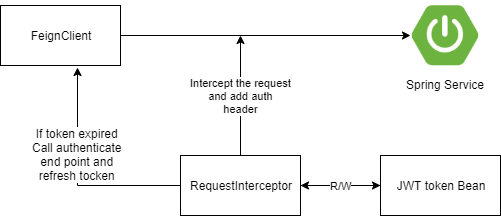

# spring-feign-jwt-client
Spring boot sample rest client application with Spring Cloud OpenFeign and JWT token

### RequestInterceptor used to add the auth header
Zero or more RequestInterceptors may be configured for purposes such as adding headers toall requests. 
No guarantees are give with regards to the order that interceptors are applied.

